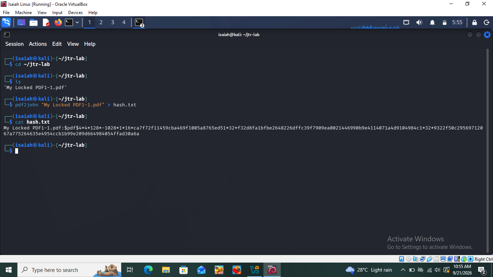
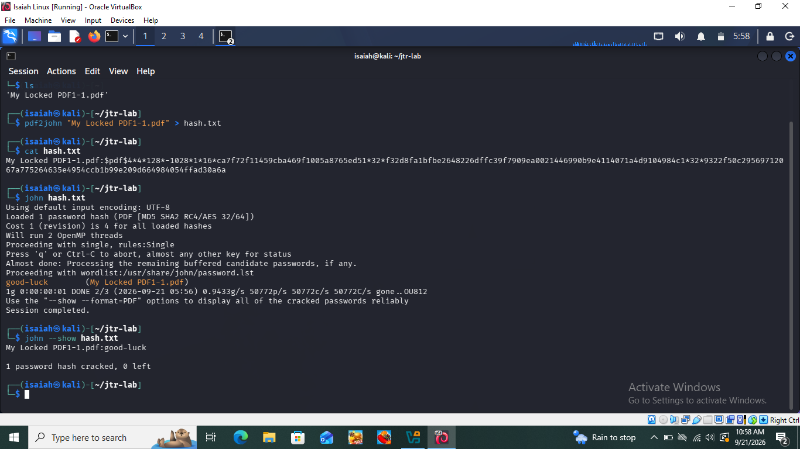
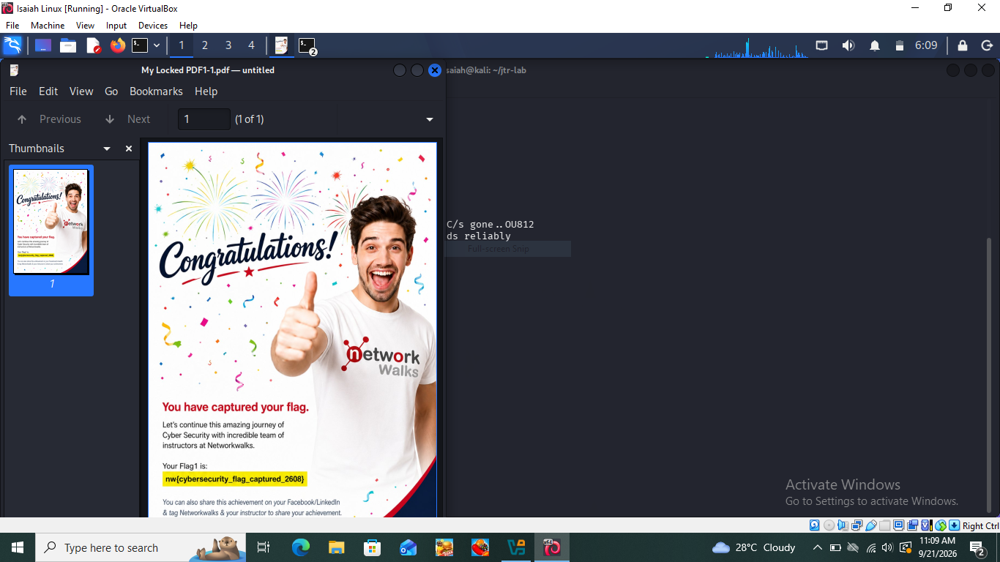
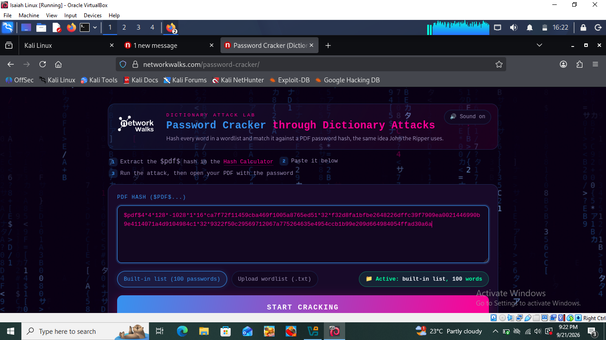
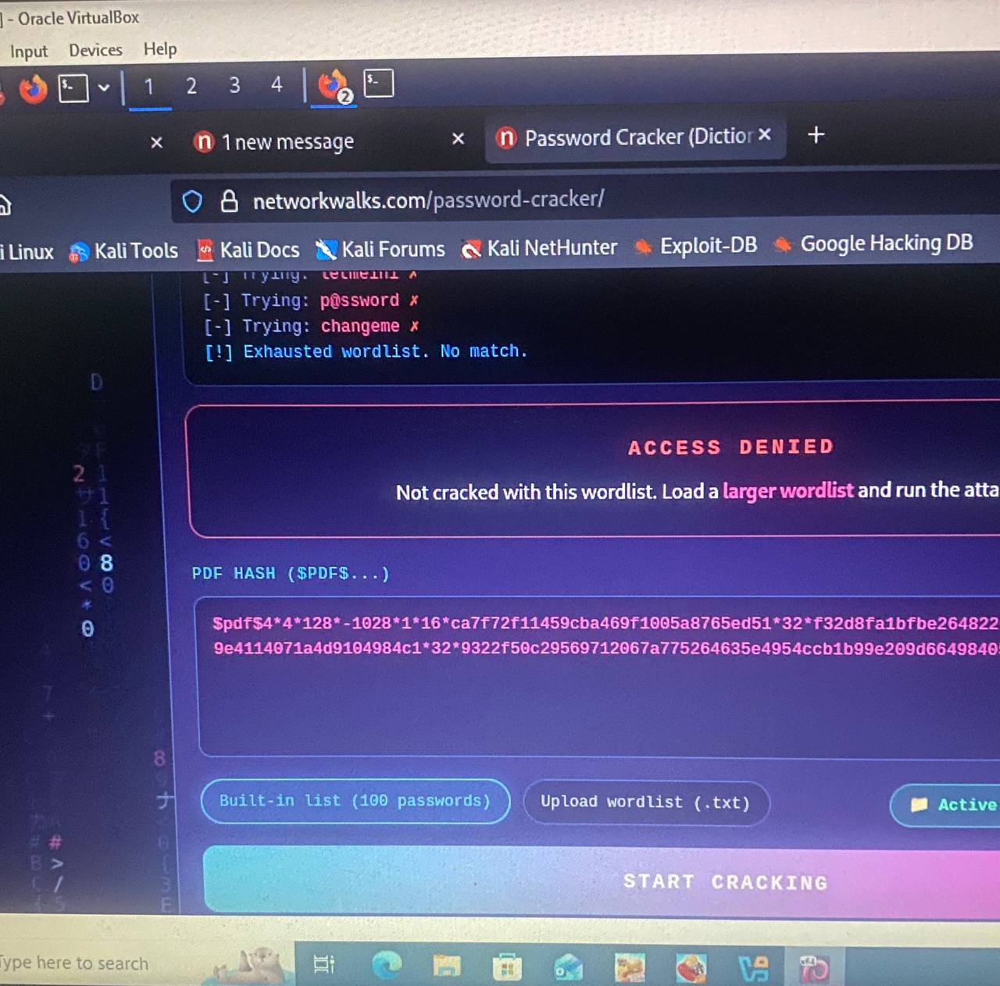
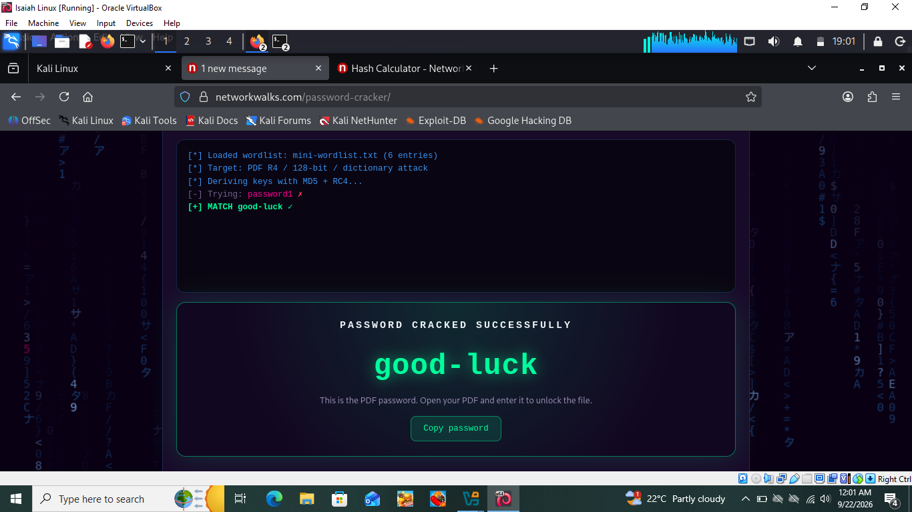
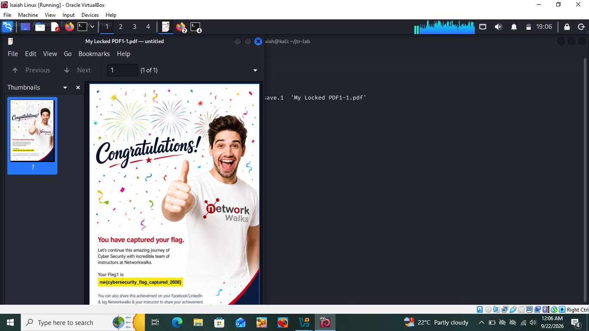

# Password Cracking — Week 3

A hands-on internship project covering password recovery of a protected PDF file using two different approaches: John the Ripper (JTR) on Kali Linux, and the Networkwalks online Hash Calculator & Password Cracker tools.

         

## 📌 About This Project

This project documents two practical exercises completed during Week 3 of my Cybersecurity internship at Networkwalks: cracking the password of a protected PDF file (`My Locked PDF1.pdf`) using two different methods — John the Ripper via command line in Kali Linux, and the Networkwalks Hash Calculator & Password Cracker web tools.

Both exercises target the same locked PDF, so together they compare a local offline cracking tool against a browser-based online cracking tool, showing two valid approaches to the same recovery task.

## 🛡️ Liability Disclaimer

I carried out these activities only on a file provided for training purposes as part of my Networkwalks Cybersecurity internship. These materials are for educational purposes only. I understand that unauthorized access or misuse of these techniques against files or systems I do not own or have permission to test is illegal, and that every action taken with this knowledge is my own responsibility.

## 🔧 Tools Used

| Tool | Purpose |
|---|---|
| Kali Linux | Operating system used to run John the Ripper for password cracking |
| John the Ripper (john) | Cracks the extracted PDF hash using its built-in wordlist |
| pdf2john | Extracts a crackable hash from the password-protected PDF |
| Networkwalks Hash Calculator | Web tool used to extract the PDF hash without any installation |
| Networkwalks Password Cracker | Web tool used to run a dictionary attack against the extracted hash |

## 🎯 Activities Performed

### 4.1 Password Cracking with JTR (W3-PM1)

I used John the Ripper in Kali Linux to crack the password of `My Locked PDF1.pdf`. This exercise focuses on offline, command-line password recovery — a core workflow for testing how strong a password is.

**Step 1 — Extract the hash:** Used `pdf2john` to convert the locked PDF into a crackable hash format and saved it to `hash.txt`.

*Hash extracted from the locked PDF and saved to hash.txt*

**Step 2 — Run John against the hash:** Ran `john hash.txt`, which loaded the hash, proceeded through single-mode rules, then the built-in wordlist, and cracked the password.

*Hash extracted from the locked PDF and saved to hash.txt*

**Step 2 — Run John against the hash:** Ran `john hash.txt`, which loaded the hash, proceeded through single-mode rules, then the built-in wordlist, and cracked the password.

*John the Ripper cracking the PDF password using the built-in wordlist*

**Step 3 — Confirm the cracked password:** Used `john --show hash.txt` to display the recovered password cleanly.

*Cracked password confirmed with john --show*

**Step 4 — Unlock the PDF:** Opened the PDF and entered the cracked password to confirm it worked.

*PDF successfully unlocked using the JTR-cracked password*

### 4.2 Password Cracking with Networkwalks Tools (W3-PM2)

I used the Networkwalks Hash Calculator and Password Cracker — two free browser-based tools — to crack the same PDF's password without installing anything. This exercise focuses on password recovery entirely through a web interface.

**Step 1 — Extract the hash:** Uploaded `My Locked PDF1.pdf` to the Networkwalks Hash Calculator, which parsed the file locally in the browser and returned a hash starting with `$pdf$...`.

*PDF uploaded to the Hash Calculator and hash extracted*

**Step 2 — Attempt with the built-in wordlist:** Pasted the hash into the Password Cracker and ran the attack using its built-in 100-word list. The attack completed but returned "Access Denied — not cracked with this wordlist," since the password wasn't in that short list.

*Built-in 100-word list exhausted with no match — Access Denied*

**Step 3 — Run with a custom wordlist:** Created a small custom wordlist containing likely candidate passwords and uploaded it instead.

**Step 4 — Password cracked:** Re-ran the attack with the custom wordlist, and the tool returned "PASSWORD CRACKED SUCCESSFULLY."

*Password cracked successfully using a custom wordlist*

**Step 5 — Unlock the PDF:** Opened the PDF and entered the cracked password to confirm it worked.

*PDF successfully unlocked using the Networkwalks-cracked password*

## 🔍 Risk Analysis and Impact

| Finding | Evidence | Potential Impact |
|---|---|---|
| Weak/common password used to protect the PDF | Both JTR and the Networkwalks tool recovered the password using standard dictionary attacks | Any attacker with access to the file could recover its contents within seconds to minutes |
| Built-in 100-word list is not sufficient on its own | Password cracker returned "Access Denied" until a targeted custom wordlist was used | Shows that relying on small default wordlists gives a false sense of security; real attackers use much larger lists (e.g. rockyou.txt) |
| Same weak password reused across the same file exported through two tools | Both JTR and Networkwalks tools recovered the identical password for the same PDF | Reinforces that password strength, not the tool used, is the real point of failure |

These findings are observations from a controlled training exercise, not a real-world vulnerability assessment. No exploitation was attempted or required beyond recovering the training file's password.

## 🐞 Problems Faced & Solutions

### Problem 1: File transfer into Kali VM

Getting the locked PDF from my Windows host into the Kali VM was difficult — VirtualBox Shared Folders and Guest Additions weren't straightforward to set up.

**Fix:** Emailed the PDF to myself and downloaded it directly using Firefox inside the Kali VM, avoiding host-to-guest file sharing entirely.

### Problem 2: File upload button not responding (Networkwalks Hash Calculator & Password Cracker)

Clicking the upload areas on both web tools didn't open a file picker reliably.

**Fix:** Used the file picker's path bar (Ctrl+L) to type the exact folder path directly instead of clicking through folders, and selected the file by typing its full path when the picker still wouldn't respond to a click.

### Problem 3: Built-in wordlist too small to crack the password

The Password Cracker's default 100-word list returned "Access Denied — not cracked with this wordlist."

**Fix:** First tried loading Kali's full `rockyou.txt` wordlist, but the in-browser attack stalled and never completed given its size (~14 million entries). Switched to a small custom wordlist containing a handful of likely candidate passwords, which cracked the hash almost instantly.

### Problem 4: VM mouse becoming unresponsive mid-task

While attempting to click "START CRACKING," the VirtualBox mouse pointer became erratic and stopped registering clicks.

**Fix:** Restarted the Kali VM, which cleared the mouse integration glitch without affecting any saved files or progress.

## 💡 Recommendations

- Avoid reusing simple, guessable passwords (e.g. "password1") for protecting sensitive files
- Use passphrases or randomly generated passwords for anything that needs real protection
- Treat any password recovered in seconds/minutes by a small wordlist as a sign the password is far too weak
- Periodically test your own protected documents against common wordlists as a personal security check
- Always perform password cracking exercises only on files you own or have explicit authorization to test

## 🎓 Conclusion

During Week 3 of my Cybersecurity internship, I completed two practical exercises covering password cracking of a protected PDF file. In the first exercise, I used John the Ripper on Kali Linux to extract and crack the file's hash entirely from the command line. In the second exercise, I used Networkwalks' own browser-based Hash Calculator and Password Cracker tools to achieve the same result without any local installation.

Both exercises recovered the same password for the same file, reinforcing that the strength of a password — not the cracking method — is what ultimately determines how quickly it can be recovered. I also learned practical troubleshooting skills along the way, including working around VM file-transfer limitations, unresponsive file pickers, and the tradeoffs between wordlist size and cracking speed.

## 👤 Author

Salifu Isaiah — Cybersecurity Intern B083
LinkedIn: [linkedin.com/in/salifu-isaiah](https://linkedin.com/in/salifu-isaiah)
GitHub: [github.com/CyberIsaiah](https://github.com/CyberIsaiah)

## 📌 Project Information

Program Name: Cybersecurity Program at Networkwalks | Week: 03 | Repository: GitHub
